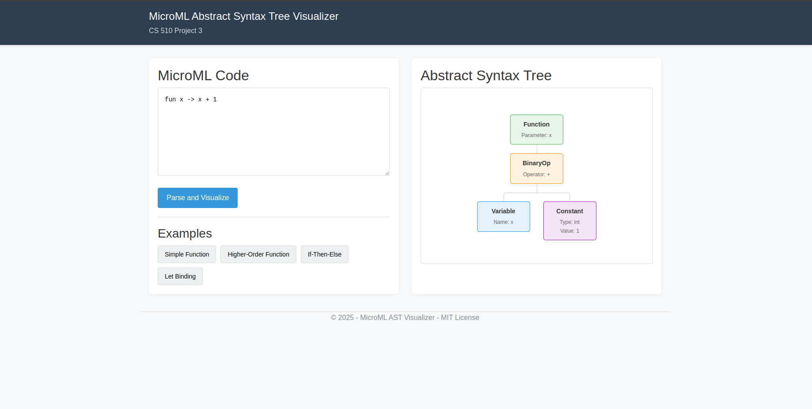
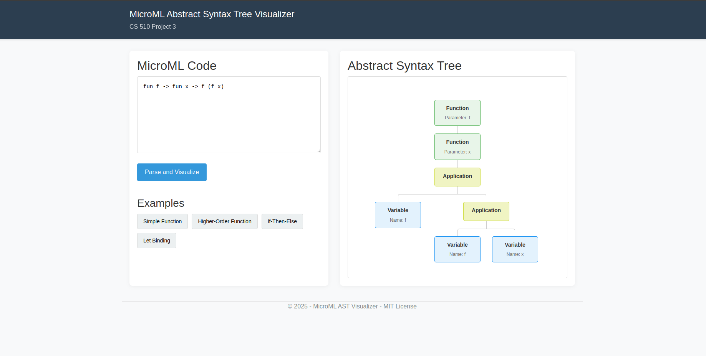
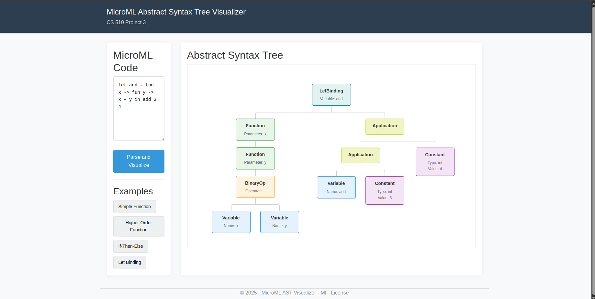
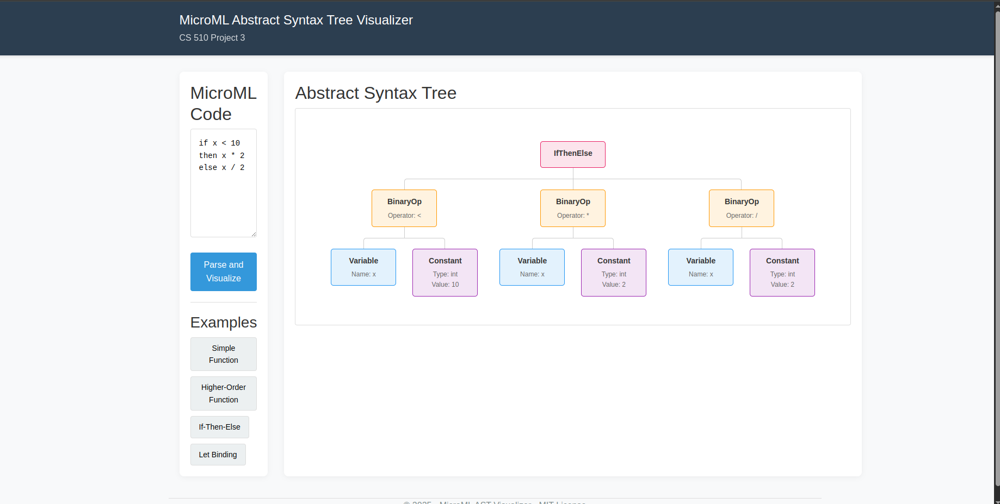

# MicroML AST Visualizer
This web app lets you see the abstract syntax tree (AST) for MicroML code.

## Features
- Parses MicroML code and shows the AST
- Has some example code you can try out
- Shows helpful error messages when your syntax is wrong


## Tech Stack
- ASP.NET Core MVC
- JavaScript
- CSS
- HTML

## How to Run
```bash
git clone [repo]
cd MicroMLVisualizer
dotnet build
dotnet run
```


## MicroML Syntax Support
The parser handles:
- Functions: fun x -> x + 1
- Let bindings: let x = 5 in x * 2
- If expressions: If x < 10 then x else 20
- Basic operations: +, -, *, /, <, >, =
- Function application
- Parentheses for grouping


## Examples

### Simple Function


### Higher-Order Function
 

### Let Binding


### If then Else



## License
MIT
